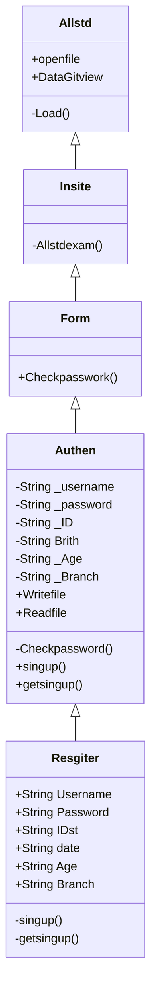

ความเป็นมา
```
    คิดว่าได้ทดสอบตัวเองเป็นเรื่องที่ดีจะได้รู้จักตัวเอง
```
วัตถุประสงค์ของโปรแกรม
```
    ทำให้คนที่มีทักษะได้ทดสอบตัวเอง
```
Class Diagram

ชื่อของผู้พัฒนาโปรแกรม
```
นาย นภสินธุ์ ศรีบุรินทร์
```